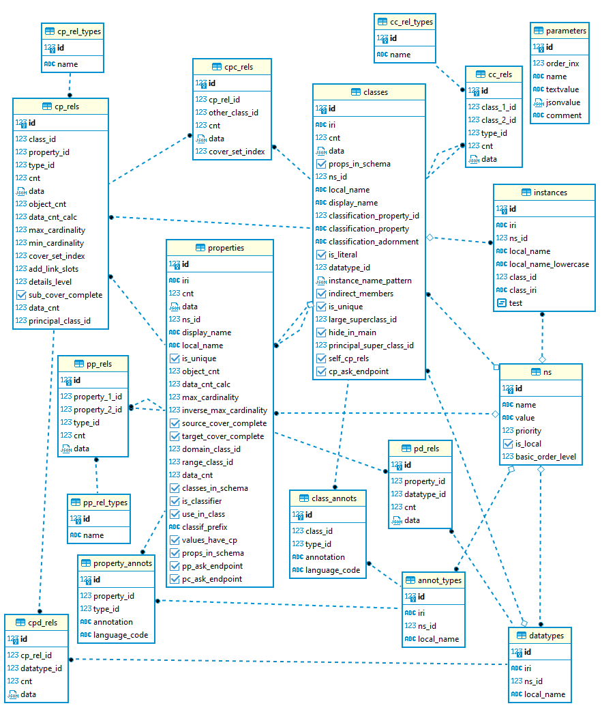
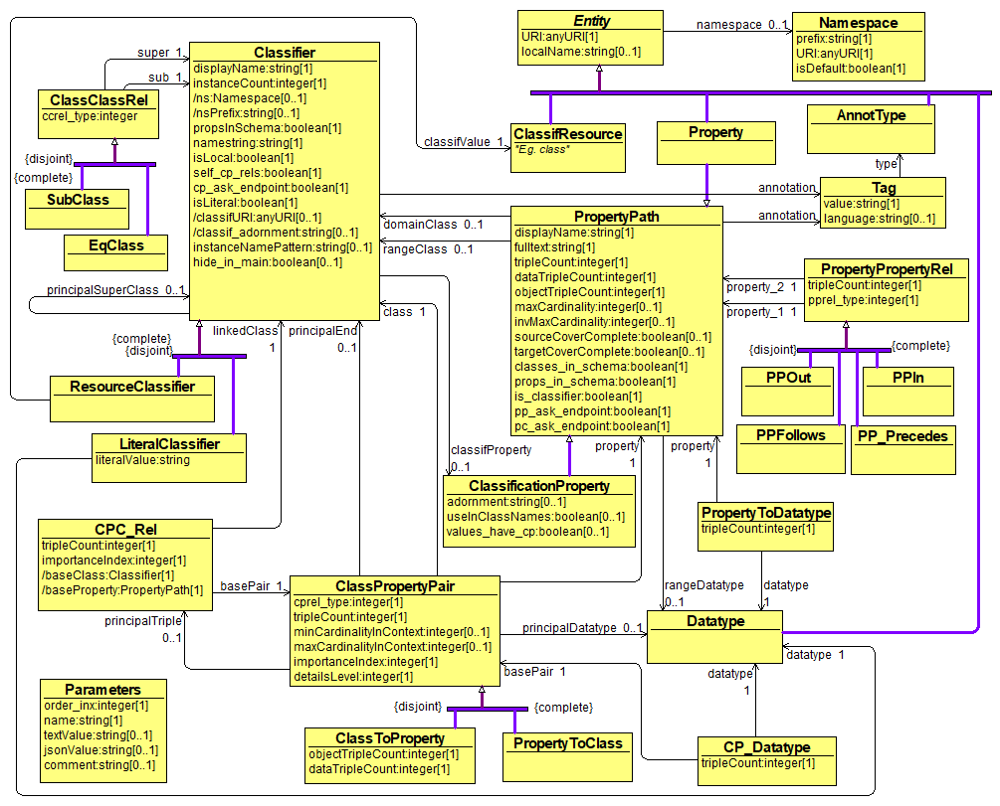

# Project Name

[](LICENSE)
[](https://www.python.org/downloads/)

## Table of Contents

- [Project Overview](#project-overview)
- [Installation](#installation)
- [Usage](#usage)


## Project Overview

Generally speaking, this python script allows generating RDF triples from SQL database by using simple user provided mappings. 

In this specific case, the script is used to generate RDF triples from a database containing SPARQL endpoint schema descriptions

This repository also shows the mappings used for generating the triples for the task mentioned above.
Aforementioned mappings specify correspondences between the following DB schema and OWL ontology.





## Installation

### Prerequisites

- Python 3.8 or higher
- [Optional dependencies, e.g., `pip`]
- Postgres DBMS. Steps to install Postgres DBMS are described [here](https://www.postgresql.org/). 

### Installation Steps

1. Import database with schema descriptions to Postgres. In this repo we provide sql file [rdfmeta_demo.sql](/rdfmeta_demo.sql) with multiple schema descriptions. To import this file one needs to:
    - create an empty database named name
    - and restore the provided dump of db, containing schema descriptions to this newly created db. The restore can be done by running the following command from console:

    ```bash
    ./psql -U postgres -h 5433 -d rdf -f rdfmeta_demo.sql
    ```
    where postgres is user name, 5433 is db port and rdf is the name of the newly created database.


2. Install the required packages:

    ```bash
    pip install -r requirements.txt
    ```
3. Create .env file. This file must contain values for the following variables : 
- USER_NAME
- USER_PSW
- PORT
- DATA_BASE_NAME

4. Set appropriate values for the following constants in python code (top part of the main.py file):
- DB_SCHEMA_NAME
- HOST
- TRG_DIR_FOR_RDF_FILES
- FPATH_TO_CLASS_MAPPINGS
- FPATH_TO_LINK_MAPPINGS
- RDF_SCHEMA_NS


## Usage

To run the project, execute the following command:

```bash
python ./main.py
```

During its execution, this program takes user-supplied mappings and on the  basis of the information found in these mappings, generates RDF triples. 

These mappings are written into .xls files: one file for [class and attribute mappings ](/Mappings_1.xlsx), and the other for [link mappings](/Mappings_links_1.xlsx). Before passing these mapping files to the .py script, they need to be saved as .csv files. Examples of these 
[.csv files](/Mappings_1.csv) can also be found in this repository.

If the program completes successfully, a series of .ntriples files should appear in the directory TRG_DIR_FOR_RDF_FILES. These files can then be uploaded to any RDF data store that supports .ntriple serialization format (e.g. [OpenLink Virtuoso](https://virtuoso.openlinksw.com/) or Apache Jena).